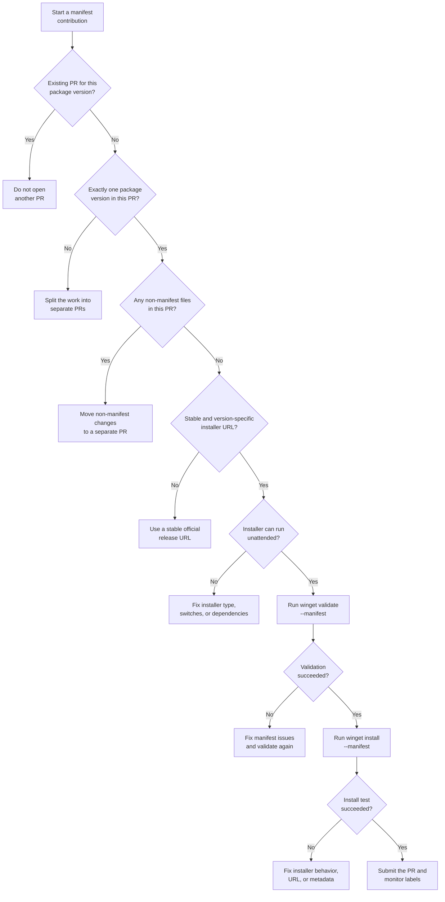

# First-Time Contributor Checklist

Use this checklist before you open your first manifest PR to `microsoft/winget-pkgs`. It focuses on the repository rules that most often cause first-pass validation failures.

## Pre-submit checklist

1. Confirm there is not already an open PR for the same package version.
2. Keep the PR to **one package version only**. In this repository, that means one multi-file manifest set for a single `PackageIdentifier` and `PackageVersion`.
3. Keep the PR to **manifest files only**. If you also need to update spelling files, `README.md`, `doc/`, tooling, or any other non-manifest file, submit those changes in a **separate PR**.
4. Use a [supported installer type](Policies.md#installer-types) and make sure the installer can run unattended.
5. Use a multi-file manifest set. Singleton manifests are not allowed in the community repository.
6. Add schema headers to every manifest file, including the `# yaml-language-server: $schema=...` comment at the top of each file.
7. Use the latest manifest version supported by the repository. See [doc\manifest\README.md](manifest/README.md) for the current schema versions.
8. Use a stable, version-specific installer URL from an official source whenever possible.
9. Validate the manifest locally:

   ```powershell
   winget validate --manifest <path-to-manifest>
   ```

10. Test the install locally:

   ```powershell
   winget settings --enable LocalManifestFiles
   winget install --manifest <path-to-manifest>
   ```

11. If possible, test in Windows Sandbox with [`Tools\SandboxTest.ps1`](tools/SandboxTest.md).
12. If your PR is a routine manifest submission, you do **not** need a separate issue first. Open an issue when you are proposing a repo change, discussing a policy/spec question, or reporting a broader problem.
13. After you submit the PR, watch for validation labels and review [ValidationFailureGuide.md](ValidationFailureGuide.md) if the bot reports a problem.

## One PR change means one package version

The repository enforces **one PR change** strictly:

- **Allowed:** one package version represented by its full multi-file manifest set
- **Not allowed:** two versions of the same package in one PR
- **Not allowed:** a manifest submission plus unrelated manifest changes
- **Not allowed:** a manifest submission plus non-manifest files such as spelling updates, `README.md`, `doc/` content, or tooling changes

If you discover a documentation, spelling, or tooling fix while preparing a manifest, finish the manifest PR first and submit the repo/documentation change as a separate PR.

## First-time contributor decision tree


